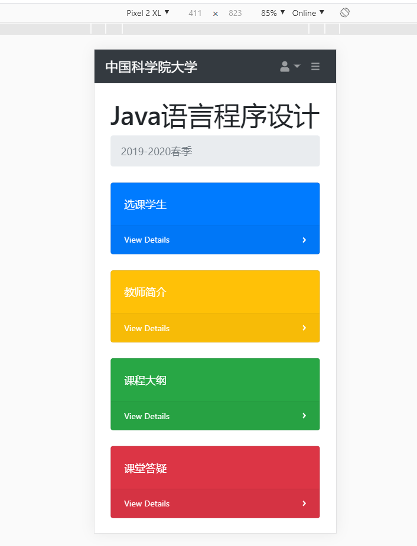

# Java语言程序设计 - 作业三
|  Name  |    学院    |   StudentID    |
| :----: | :-------------: | :-------------: |
| 赵智韬 | 资源与环境学院 | 201928007010048 |

### 简介

本项目为 中国科学院大学 Java语言程序设计19-20春季 课程作业

独立完成，部署于阿里云服务器 —— [项目地址链接](http://101.200.48.132:8082/admin.html) —— GitHub托管地址
`若服务器停机 联系邮箱 2418660459@qq.com`


&nbsp;
&nbsp;
**1. 程序设计作业要求：**
- 从文件、网络或**数据库读取数据**（格式自定、数据自定），显示**统计结果**（包括图形二种以上）， **用户界面自定**
- 可**不超过3人组队**完成，说明各自工作（仅设计及文档得分系数0.95，编程及调试得分系数1.05）
- **打包提交**，命名格式：姓名_学号，提交内容包括：设计文档、源代码文件、编译后的文件、分工情况

**2. 技术栈：**
- SpringBoot 2.2.0
- BootStrap 4
- Thymeleaf
- Mybatis
- MySQL


### 任务分工
|  姓名  |    任务量    |   
| :----: | :-------------: |
| 赵智韬 | 设计文档编写、前端页面、后端代码、数据库| 

### 网页预览

**首页：**

**学生数据统计页：**


**教师简介：**

**课程大纲：**

**课程答疑：**

**资料下载：**

**BootStrap响应式布局（移动端）：**


### 部分代码

**Student实体类**
```java
import lombok.Data;

@Data
public class Student {
    private String name;
    private String sex;
    private Integer age;
    private String college;
}
```
**学生信息数据库**
```SQL
DROP TABLE IF EXISTS `student`;
/*!40101 SET @saved_cs_client     = @@character_set_client */;
/*!40101 SET character_set_client = utf8 */;
CREATE TABLE `student` (
  `id` int(11) unsigned NOT NULL AUTO_INCREMENT,
  `name` varchar(100) NOT NULL DEFAULT '',
  `sex` varchar(50) DEFAULT '',
  `age` int(11) DEFAULT NULL,
  `college` varchar(100) DEFAULT NULL,
  PRIMARY KEY (`id`)
) ENGINE=InnoDB AUTO_INCREMENT=229 DEFAULT CHARSET=utf8 ROW_FORMAT=COMPACT;
/*!40101 SET character_set_client = @saved_cs_client */;

--
-- Dumping data for table `student`
--
INSERT INTO `student` VALUES 
(33,'Rank','男',19,'资源与环境学院'),(34,'Adans','男',20,'软件学院')
(33,'Rank','男',19,'资源与环境学院'),(34,'Adans','男',20,'软件学院')
.....略
LOCK TABLES `student` WRITE;
```
**Controller**
```java
@Controller
public class StudentController {
    @Autowired
    private StudentService studentService;

    @GetMapping("studentjson")
    @ResponseBody
    public List<Student> jsonstudent() { return studentService.findAll();  }

    @RequestMapping("admin")
    public String admin(){ return  "admin"; }

    @RequestMapping("dist/index")
    public String dashboard(){ return "dist/index";}
```

**Service层**
```java
@Service
public class StudentService {
    @Autowired
    private StudentMapper studentMapper;

    public List<Student> findAll(){
        return studentMapper.findAll();
    }

}
```

**请求后台数据统计**
```javascript
$.ajax({//JQuery的ajax请求方法
            type: "GET",//以GET方式请求
            url: "/studentjson",//请求的路径是/studentjson，即我们有json数据返回的路径 restful风格
            dataType: "json",//数据格式，json格式
            async: false,//是否异步请求
            success: function (result) {//请求成功执行的方法
                //将请求到的结果拼装进我们自行的空数组productName与nums
                for (var i = 0; i < result.length; i++) {
                    agearray.push(result[i].age);
                    sexarray.push(result[i].sex);
                    collegearray.push(result[i].college);
                }

            },
            error: function (errorMsg) {//请求成功执行的方法
                alert("获取后台数据失败！");
            }
        });
```

**学院分布信息 画图（Chart.js）**
```javascript
console.log("college stat",college_stat);
var myLineChart = new Chart(ctx, {
  type: 'bar',
  data: {
    labels: ["计算机学院", "资源与环境学院", "微电子学院", "物理学院", "生物学院", "软件学院"],
    datasets: [{
      label: "人数",
      backgroundColor: "rgba(2,117,216,1)",
      borderColor: "rgba(2,117,216,1)",

      // 此处修改为统计数组college_statistic
      data: college_stat //[20,30,60,50,40,31],
    }],
  },
  options: {
    scales: {
      xAxes: [{
        time: {
          unit: 'month'
        },
        gridLines: {
          display: false
        },
        ticks: {
          maxTicksLimit: 6
        }
      }],
      yAxes: [{
        ticks: {
          min: 0,
          max: 60,
          maxTicksLimit: 5
        },
        gridLines: {
          display: true
        }
      }],
    },
    legend: {
      display: false
    }
  }
});
```

### 源代码目录树

> **java**
├─controller
│      HelloController.java
│      StudentController.java
│
├─domain
│      Student.java
│
├─mapper
│      StudentMapper.java
│
├─service
│      StudentService.java
│
└─serviceImpl

> **resources**
│  admin.html
│
├─dist
│  │  downloadfile.html
│  │  index.html
│  │  QA.html
│  │  students.html
│  │  syllabus.html
│  │  teacher.html
│  │
│  ├─assets
│  │  ├─demo
│  │  │      chart-area-demo.js
│  │  │      chart-bar-demo.js
│  │  │      chart-pie-demo.js
│  │  │      datatables-demo.js
│  │  │
│  │  └─img
│  ├─css
│  │    &nbsp;&nbsp;  styles.css
│  └─js
│   &nbsp;&nbsp;    &nbsp;  &nbsp; scripts.js
│
└─src
    ├─assets
    │  ├─demo
    │  │&nbsp;&nbsp;&nbsp;&nbsp; chart-area-demo.js
    │  │&nbsp;&nbsp;&nbsp;&nbsp; chart-bar-demo.js
    │  │&nbsp;&nbsp;&nbsp;&nbsp; chart-pie-demo.js
    │  │&nbsp;&nbsp;&nbsp;&nbsp; datatables-demo.js
    │  │
    │  └─img
    │
    ├─js
    │    &nbsp;  scripts.js
    │
    ├─pug
